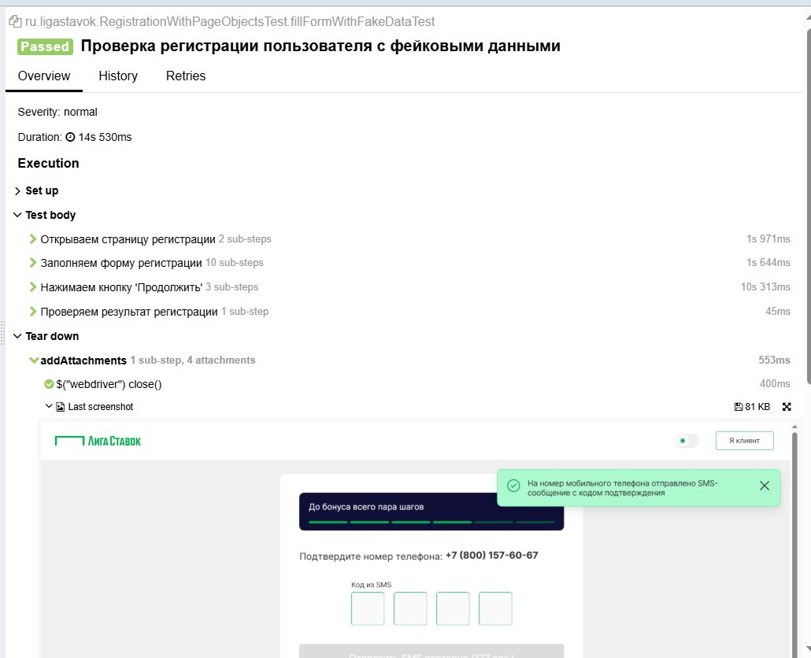
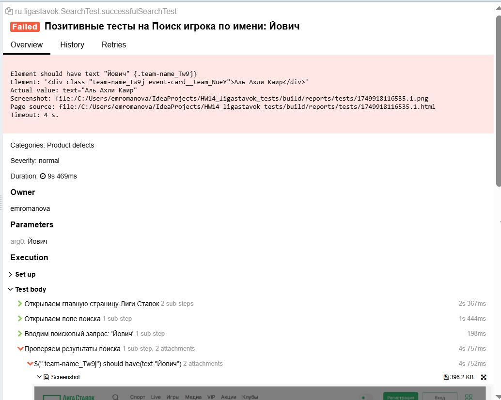
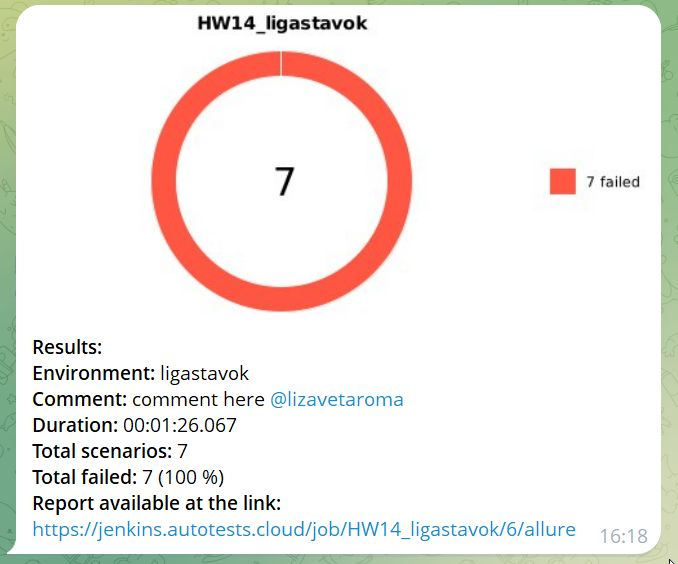

# 

# UI Autotests for Ligastavok

Проект с автотестами  на Selenide для сайта [https://www.ligastavok.ru/](https://www.ligastavok.ru/)

## 🔧 Технологии и инструменты

- Java
- Selenide
- JUnit 5
- Gradle
- Allure Report
- Jenkins
- Telegram Bot
- Selenoid

## 📁 Структура проекта
src/
└── test/
    └── java/         
        ├── helpers/   # Хелперы
        ├── pages/     #PageObject классы
        └── ru.ligastavok/ #UI тесты

---

## ▶️ Запуск тестов

Локальный запуск:
gradle clean test

Удалённый запуск:
gradle clean test -Dremote=true

Запуск с параметрами:
-Dbrowser=chrome -Dversion=100 -Dsize=1920x1080

---

## 📊 Allure отчет

После прохождения тестов:
allure serve build/allure-results

## 🔗 Ссылки
- 🛠 [Jenkins Job](https://jenkins.autotests.cloud/job/HW14_ligastavok/)
- 📈 [Allure Report](https://jenkins.autotests.cloud/job/HW14_ligastavok/allure/)

### Успешный тест:

### Упавший тест:

### 🎞 Видео прохождения теста

Процесс реализован в Jenkins и включает:

- ✅ Отчёт Allure
- ✅ Telegram-уведомления

## 📬 Уведомления в Telegram

После каждой сборки Jenkins отправляется сообщение с результатами:
- статус сборки
- общее количество тестов
- количество упавших
- ссылка на Allure-отчёт
  

## 👤 Автор

Elizaveta Romanova — QA Automation Engineer  
GitHub: [@LizaRoma-lab](https://github.com/LizaRoma-lab)